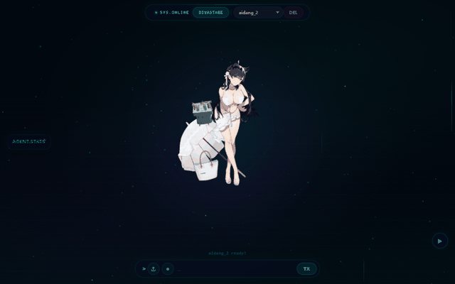

# 馃 SekaiForm 路 琛ㄥ崟涓?AI 瀵硅瘽绯荤粺

> **Spring Boot + Thymeleaf + MyBatis 琛ㄥ崟绯荤粺 路 鎰忓浘璇嗗埆 路 宸ュ叿璋冪敤 路 Live2D 瑙掕壊**
> Form system with intent recognition, tool calling, and Live2D characters

[](https://www.oracle.com/java/)
[](https://spring.io/projects/spring-boot)
[](https://www.thymeleaf.org/)
[](https://mybatis.org/)
[](https://www.live2d.com/)
[](#)
[](LICENSE)

A form & AI dialogue system built with **Spring Boot + Thymeleaf + MyBatis**: collect user form data, recognize intents, call tools, and render **Live2D characters** in the browser via pixi-live2d.

鍩轰簬 **Spring Boot + Thymeleaf + MyBatis** 鐨勮〃鍗曚笌 AI 瀵硅瘽绯荤粺锛氭敹闆嗙敤鎴疯〃鍗曟暟鎹€佹剰鍥捐瘑鍒笌宸ュ叿璋冪敤锛屾敮鎸?Live2D 瑙掕壊灞曠ず銆?

<p align="center">
  
</p>
---

## 鉁?Features / 鏍稿績鍔熻兘

- 鐢ㄦ埛琛ㄥ崟濉啓涓庢彁浜?User form filling & submission
- 鎰忓浘璇嗗埆锛坕ntent锛変笌澶氳疆瀵硅瘽 Intent recognition & multi-turn dialogue
- 鍩庡競閫夋嫨 / 鏃ュ織璁板綍 / 妯″瀷閫夋嫨 City selection / logging / model selection
- **Live2D锛坧ixi-live2d锛夎鑹插睍绀?* Live2D character display
- **宸ュ叿璋冪敤锛坱ool choice锛?* Tool calling
- 瀵硅瘽鐘舵€佹鏌ヤ笌寮傛澶勭悊 Dialogue state checks & async handling

## 馃搻 Project Structure / 椤圭洰缁撴瀯

```text
sekai-form-ai
鈹溾攢鈹€ SekaiForm/              # Spring Boot 涓婚」鐩?(com.sekai.sekai_form, control/service/dataobject 鍒嗗眰)
鈹?  鈹溾攢鈹€ src/                # 鍚庣 + 鍓嶇 (Thymeleaf + static)
鈹?  鈹溾攢鈹€ models/2d/          # Live2D 妯″瀷 (hiyori / haru / aidang / biaoqiang)
鈹?  鈹斺攢鈹€ pom.xml
鈹斺攢鈹€ README.md
```

- `SekaiForm/models/2d/`锛歀ive2D 瀹樻柟鍏嶈垂绀轰緥妯″瀷锛圠ive2D Free Sample Models锛夛紝鍙洿鎺ヤ娇鐢?
## 鈻讹笍 Quick Start / 蹇€熷紑濮?
```powershell
cd SekaiForm
# 閰嶇疆鐜鍙橀噺锛堝 DASHSCOPE_API_KEY锛岀敤浜?AI 瀵硅瘽锛?mvn spring-boot:run
```

- 鏁版嵁搴擄細`sekai_friend`锛屼笟鍔¤〃缁熶竴 `sekai_form_` 鍓嶇紑
- 涓氬姟鏁版嵁琛ㄧ敱 `src/main/resources/schema.sql` 鍒濆鍖?
## 馃摑 Notes / 璇存槑

- AI 瀵硅瘽闇€瑕侀厤缃ぇ妯″瀷 API Key锛堥€氳繃鐜鍙橀噺 `DASHSCOPE_API_KEY` 绛夋敞鍏ワ級
- Live2D 妯″瀷涓?Live2D Inc. 瀹樻柟鍏嶈垂绀轰緥锛岄伒寰叾 Free Material License

## 馃搫 License

[MIT](LICENSE) 漏 2026 [sekai-lyr](https://github.com/sekai-lyr)

---

**猸?If this project helped you, star it! 濡傛灉杩欎釜椤圭洰瀵逛綘鏈夊府鍔╋紝娆㈣繋 Star锛?*

